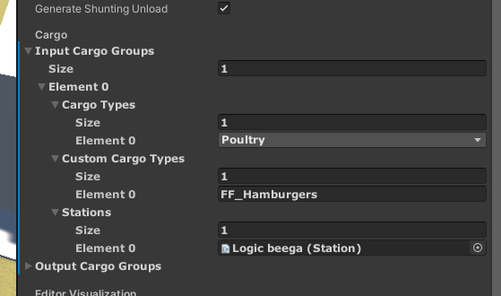

# Job Generation

## Station Setup

To get job generation working, you'll need to have at least two stations.
Stations can be created using the prefabs in `Mapify/Prefabs/Station`, or you can use your own.

### Input/Output Cargo Groups

These two lists are where you'll define the production chains of your map.
Each element contains a list of cargo types, and a list of stations.

These define what cargo types can go to, or come from, each station on the map.

## Warehouse Machines

To load and unload cars, you'll need at least one warehouse machine with a loading track at each station.
Warehouse Machines can support different cargo types, allowing you to have different areas for different cargo in the same station.

## Cargo types

There are 2 ways to specify cargo types on a warehouse machine or station. Under "Cargo Types" there's a dropdown menu containing every cargo in the base game. 

"Custom Cargo Types" is for cargos of the [Custom Cargo mod](https://www.nexusmods.com/derailvalley/mods/907?tab=description). Enter the exact identifier of the cargo. You can find it by going to the folder of the cargo mod -> open `cargo.json` -> look for `Identifier`.

## Assigning Tracks

On each `Track` component there are four fields related to job generation

- Station ID
- Yard ID
- Track ID
- Track Type

These fields should be pretty self-explanatory.

For job generation to occur, there must be at least one of each of the following types at all stations:

- Storage/PassengerStorage
- Loading/PassengerLoading
- In
- Out
